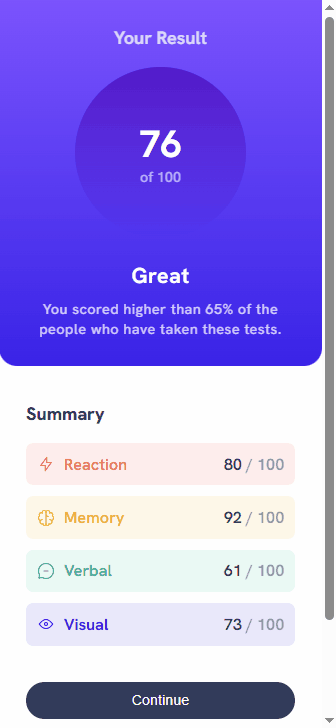
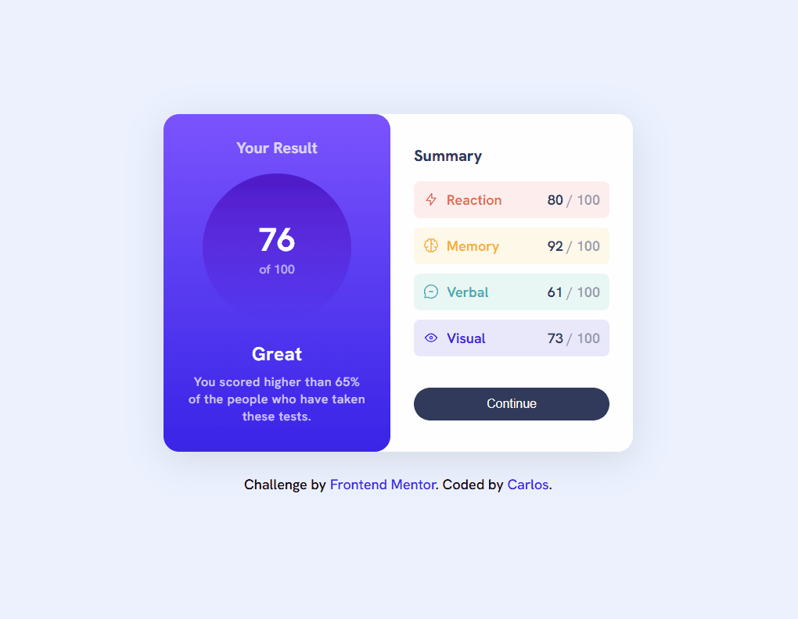

🎯 Results Summary Component
Projeto desenvolvido a partir do desafio <a href="https://www.frontendmentor.io/challenges/results-summary-component-CE_K6s0maV" target="_blank" rel="noopener noreferrer">Results Summary Component</a> do **Frontend Mentor**.

📋 Descrição
Este é um componente simples que apresenta um resumo de resultados com uma pontuação destacada e uma lista de habilidades avaliadas. O **layout** é responsivo e segue o design original fornecido pelo desafio, utilizando **HTML** e **CSS** puros.

📸 Screenshot
| Versão Mobile | Versão Desktop |
|---------------|----------------|
| | |

🛠 Tecnologias usadas
 - 🧱 **HTML5**
 - 🎨 **CSS3** (com variáveis CSS e flexbox)
 - 🔤 **Google fonts**: (Hanken Grotesk)

🎓 Aprendizado
Durante o desenvolvimento deste projeto, pude reforçar e aprimorar diversos conceitos importantes de frontend, tais como:

- 📐 **Design responsivo**: Pratiquei a criação de layouts que se adaptam bem a diferentes tamanhos de tela, utilizando flexbox e media queries.
🎨 **Uso de variáveis CSS**: Aprendi a organizar melhor as cores e estilos usando custom properties (`--variáveis`), o que facilita a manutenção e consistência do design.
- ⚙️ **Estrutura semântica**: Trabalhei na organização do HTML com elementos semânticos para melhorar acessibilidade e SEO.
- 💡 **Detalhes visuais**: Exercitei a criação de efeitos visuais sutis como gradientes, transparências (`hsla`) e sombras para deixar o design mais moderno e atraente.

🔗 Links
- URL da solução: <a href="https://github.com/slayer-br/result-summary" target="_blank" rel="noopener noreferrer">Results Summary Component</a>
- Site ao vivo: <a href="https://slayer-br.github.io/result-summary/" target="_blank" rel="noopener noreferrer">Results Summary Component</a>

## 👨‍💻 Autor
- GitHub - <a href="https://github.com/slayer-br" target="_blank" rel="noopener noreferrer">@slayer-br</a>
- Frontend Mentor - <a href="https://www.frontendmentor.io/profile/slayer-br" target="_blank" rel="noopener noreferrer">@slayer-br</a>

📝 Licença
Este projeto está sob a licença [MIT](LICENSE), sinta-se livre para usar e modificar.

